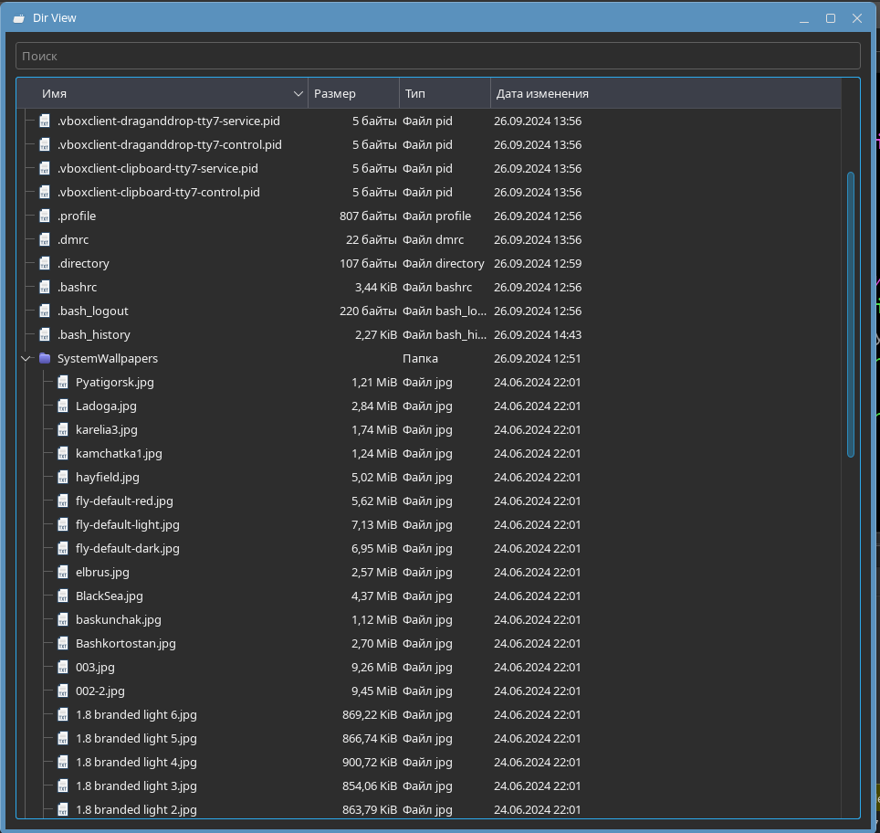
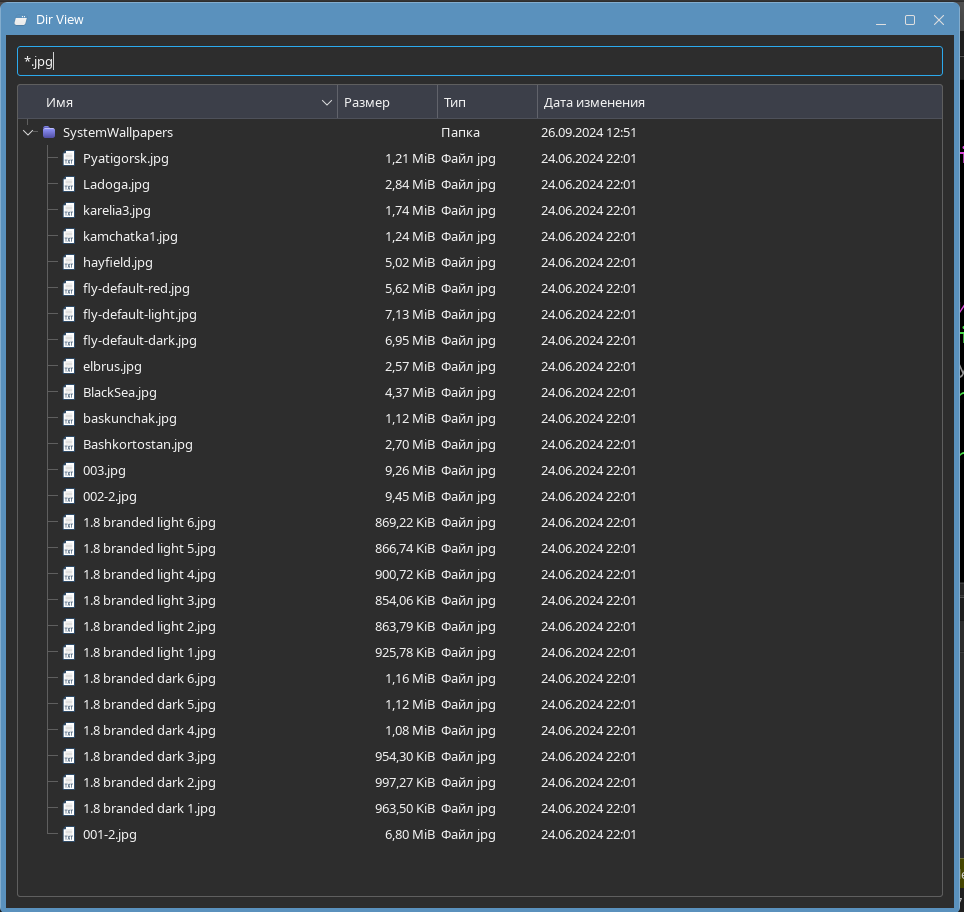

# Тестовое задание (стажировка)

Установить Astra Linux 1.7/1.8 на виртуалку. Дистрибутив можно скачать из личного кабинета через регистрацию тут: https://dev.astragroup.ru/

Обновиться до последней версии.

Установить из нашего репозитория QtCreator и пакет qtbase5-examples (pyqt5-examples для Python).

Открыть проект examples/widgets/itemviews/dirview (examples/itemviews/dirview.py для Python)

Сделать стартовой директорией домашнюю директорию текущего пользователя. То есть того пользователя что запускает утилиту.

Отображать файлы, папки, в том числе и скрытые.

Добавить QLineEdit виджет, который использовать для фильтрации по именам файлов и папок.

# Запуск

Открыть файл проекта *dirview.pro* через QtCreator, скомпилировать и запустить программу.

# Демонстрация работы приложения

